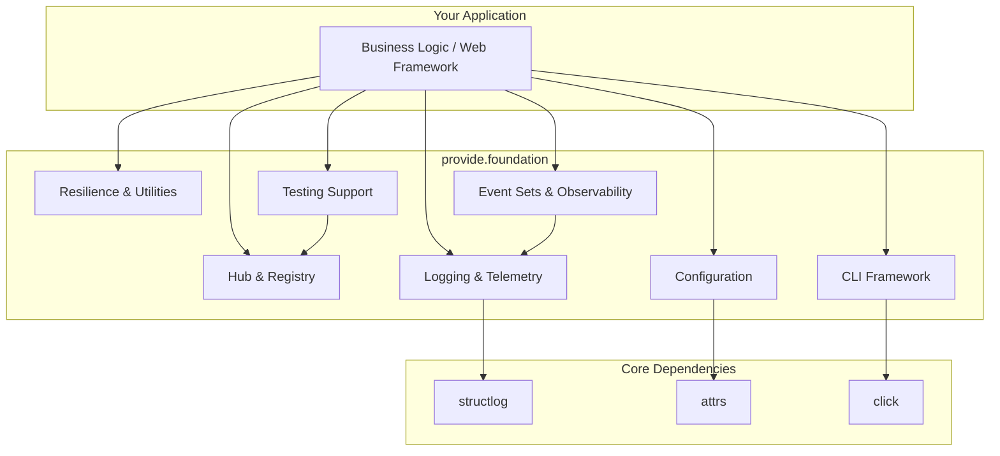
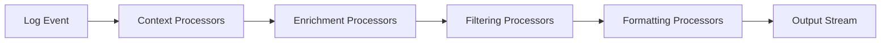
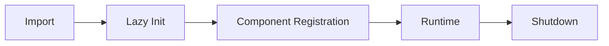

# Explanation: Architecture

`provide.foundation` is designed as a layered, framework-agnostic library that provides common infrastructure for building high-quality Python applications.



## Architectural Overview

provide.foundation is structured around several key design principles:

1. **Foundation Layer, Not Framework**: Provides building blocks rather than dictating application structure
2. **Lazy Initialization**: Minimal overhead until features are actively used
3. **Global Singletons for Ergonomics**: Balanced with testing utilities for clean test isolation
4. **Type Safety**: Comprehensive type hints with runtime validation where needed
5. **Production-First Design**: Thread-safe, performant, and observable by default

## Core Components

### Hub & Registry System

The **Hub** (`provide.foundation.hub`) is the architectural cornerstone, providing:

#### Component Registry
- **Centralized component management** with lifecycle control
- **Dependency injection** for loosely-coupled architecture
- **Thread-safe registration** using `threading.RLock`
- **Component discovery** for plugins and extensions

```python
from provide.foundation import get_hub

hub = get_hub()
hub.register_component("database", DatabaseConnection())
db = hub.get_component("database")
```

#### Command Registry
- **Declarative CLI command registration** via `@register_command`
- **Automatic help generation** from docstrings and type hints
- **Nested command hierarchies** with dot notation
- **Command metadata** (aliases, categories, tags)

```python
from provide.foundation.hub import register_command

@register_command("db.migrate", aliases=["migrate"], category="database")
def migrate_database():
    """Run database migrations."""
    pass
```

#### Design Decisions
- **Threading Model**: Uses `threading.RLock` rather than `asyncio.Lock` for broader compatibility
- **Performance Impact**: Negligible for typical use cases (CLI apps, initialization-time registration)
- **Trade-off**: Not optimized for high-throughput async services with runtime registration in hot paths

### Logging & Telemetry System

The **Logger** (`provide.foundation.logger`) provides structured logging built on `structlog`:

#### Key Features
- **Lazy Initialization**: Logger auto-initializes on first use to avoid import-time side effects
- **Event-Driven Enrichment**: Structured logging with Domain-Action-Status patterns
- **Emoji-Enhanced Output**: Visual parsing for human-readable logs (configurable)
- **Performance**: >14,000 messages/second with emoji processing enabled
- **Thread-Safe**: All logging operations are thread-safe and async-compatible

#### Processor Pipeline


Processors include:
- **Context injection** (timestamp, caller info, thread ID)
- **Event enrichment** (emoji mapping, domain/action/status extraction)
- **Filtering** (log level, module-level configuration)
- **Formatting** (console vs JSON, color support)
- **Output** (stdout, stderr, file, custom streams)

#### Configuration
```python
from provide.foundation import get_hub, LoggingConfig, TelemetryConfig

# Simple configuration
config = TelemetryConfig(
    logging=LoggingConfig(
        default_level="INFO",
        logger_name_emoji_prefix_enabled=True,
        das_emoji_prefix_enabled=True,
        console_formatter="key_value"
    )
)

hub = get_hub()
hub.initialize_foundation(config)

# Advanced configuration
advanced_config = TelemetryConfig(
    logging=LoggingConfig(
        default_level="DEBUG",
        logger_name_emoji_prefix_enabled=True,
        das_emoji_prefix_enabled=True,
        console_formatter="key_value",
        module_levels={"urllib3": "WARNING"}
    )
)
hub.initialize_foundation(advanced_config)
```

### Configuration System

The **Config** (`provide.foundation.config`) module provides:

#### BaseConfig Pattern
```python
from provide.foundation.config import BaseConfig, env_field
from attrs import define

@define
class DatabaseConfig(BaseConfig):
    host: str = env_field(env_var="DB_HOST", default="localhost")
    port: int = env_field(env_var="DB_PORT", default=5432)
    # Supports file:// prefix for reading secrets from files
    password: str = env_field(env_var="DB_PASSWORD")

config = DatabaseConfig.from_env()
```

#### Features
- **Type validation** through `attrs`
- **Environment variable parsing** with automatic type coercion
- **Secret management** with `file://` prefix support
- **Immutable by default** with frozen dataclasses
- **Clear precedence**: Environment variables > file values > defaults

#### Environment Variable APIs

Foundation provides two complementary APIs:

**1. Direct Access** (`utils.environment`):
```python
from provide.foundation.utils.environment import get_bool, get_int, get_str

debug = get_bool("DEBUG", default=False)
port = get_int("PORT", default=8080)
```

**2. Structured Config** (`config.env`):
```python
from provide.foundation.config import BaseConfig, env_field

@define
class AppConfig(BaseConfig):
    debug: bool = env_field(env_var="DEBUG", default=False)
    port: int = env_field(env_var="PORT", default=8080)
```

### State Management

The **State** (`provide.foundation.state`) module provides:

- **ImmutableState**: Thread-safe immutable state containers
- **StateMachine**: Finite state machine implementation
- **StateManager**: Centralized state management
- **ConfigManager**: Configuration versioning and updates
- **VersionedConfig**: Configuration with change tracking

Useful for:
- Application lifecycle state tracking
- Configuration hot-reloading
- Audit trails for state changes
- State machines for complex workflows

### CLI Framework

The **CLI** (`provide.foundation.cli`) module provides a declarative framework built on `click`:

#### Features
- **Automatic command discovery** via `@register_command`
- **Type-safe arguments** with automatic validation
- **Rich output utilities** (`pout()`, `perr()` for user-facing output)
- **Interactive prompts** with validation
- **Context management** for CLI runtime state

#### Design Pattern
```python
from provide.foundation.hub import register_command
from provide.foundation.cli import pout, perr
from provide.foundation import logger

@register_command("deploy")
def deploy_app(environment: str, force: bool = False):
    """Deploy application to specified environment."""
    # User-facing output
    pout(f"Deploying to {environment}...")

    # Internal logging
    logger.info("deployment_started", env=environment, force=force)

    try:
        # Deployment logic
        pass
    except Exception as e:
        logger.error("deployment_failed", error=str(e))
        perr(f"❌ Deployment failed: {e}")
        raise
```

### Resilience Patterns

The **Resilience** (`provide.foundation.resilience`) module provides:

#### Retry Pattern
```python
from provide.foundation.resilience import retry
from provide.foundation.errors import NetworkError

@retry(max_attempts=3, backoff=2.0, exceptions=(NetworkError,))
def fetch_data():
    """Fetch data with automatic retry on network errors."""
    pass
```

Features:
- **Exponential backoff** with configurable multiplier
- **Maximum attempts** and timeout support
- **Exception filtering** (only retry specific exceptions)
- **Jitter** for distributed system resilience

#### Circuit Breaker
```python
from provide.foundation.resilience import circuit_breaker

@circuit_breaker(failure_threshold=5, timeout=60.0)
def call_external_api():
    """Call external API with circuit breaker protection."""
    pass
```

States: **Closed → Open → Half-Open → Closed**

### Data & Serialization

#### File Operations
- **Atomic writes** to prevent partial writes
- **Change detection** for file watching
- **Format support** (JSON, YAML, TOML, text)
- **Safety guarantees** (temp files, rename operations)

#### Archive Operations
- **TAR, ZIP, GZIP, BZIP2** support
- **Streaming** for large files
- **Compression** with zstandard (optional)

#### Serialization
- **Type-safe JSON** serialization with `provide_dumps`/`provide_loads`
- **Custom encoders** for complex types
- **Schema validation** support

### Concurrency Utilities

The **Concurrency** (`provide.foundation.concurrency`) module provides:

- **AsyncLockManager**: Async-safe lock management
- **LockManager**: Thread-safe lock management
- **Task coordination** utilities
- **Async context managers**

### Utilities Suite

Foundation includes comprehensive utilities:

#### Time Utilities
```python
from provide.foundation.time import provide_now, provide_sleep

now = provide_now()  # Timezone-aware current time
await provide_sleep(1.0)  # Async-compatible sleep
```

#### Formatting Utilities
```python
from provide.foundation.formatting import format_table, format_bytes, to_snake_case

# Table formatting
print(format_table(data, headers=["Name", "Value"]))

# Byte size formatting
print(format_bytes(1024 * 1024))  # "1.0 MB"

# Case conversion
print(to_snake_case("CamelCase"))  # "camel_case"
```

#### Platform Detection
```python
from provide.foundation.platform import get_os_info, is_macos

if is_macos():
    # macOS-specific logic
    pass
```

## Initialization & Lifecycle

### Initialization Patterns

#### 1. Zero Configuration (Recommended for Simple Cases)
```python
from provide.foundation import logger

# Logger auto-initializes on first use
logger.info("app_started")
```

#### 2. Explicit Initialization (Recommended for Production)
```python
from provide.foundation import get_hub, LoggingConfig, TelemetryConfig

config = TelemetryConfig(
    service_name="my-service",
    logging=LoggingConfig(
        default_level="INFO",
        logger_name_emoji_prefix_enabled=True,
        das_emoji_prefix_enabled=True
    )
)

hub = get_hub()
hub.initialize_foundation(config)
```

#### 3. Advanced Configuration
```python
from provide.foundation import get_hub, LoggingConfig, TelemetryConfig

logging_config = LoggingConfig(
    default_level="DEBUG",
    logger_name_emoji_prefix_enabled=True,
    das_emoji_prefix_enabled=True,
    console_formatter="key_value",
    module_levels={
        "urllib3": "WARNING",
        "asyncio": "INFO"
    }
)

telemetry_config = TelemetryConfig(
    service_name="my-service",
    logging=logging_config
)

hub = get_hub()
hub.initialize_foundation(telemetry_config)
```

### Lifecycle Management



1. **Import Time**: Minimal overhead, no side effects
2. **Lazy Initialization**: Components initialize on first use
3. **Component Registration**: Register custom components, commands
4. **Runtime**: Normal application execution
5. **Shutdown**: Graceful cleanup of resources

### Graceful Shutdown

Foundation provides `shutdown_foundation()` for clean resource cleanup:

```python
from provide.foundation import shutdown_foundation

# At application shutdown
shutdown_foundation()
```

This function:
- Flushes any pending log messages
- Closes file handlers
- Releases resources
- Resets internal state (useful for testing)

**When to use:**
- Before process termination in CLI applications
- In web framework shutdown hooks (FastAPI `@app.on_event("shutdown")`)
- Between test runs (handled automatically by `provide-testkit`)

### Shutdown Examples for Web Frameworks

#### FastAPI
```python
from fastapi import FastAPI
from provide.foundation import shutdown_foundation

app = FastAPI()

@app.on_event("shutdown")
async def shutdown():
    """Gracefully shutdown Foundation on app termination."""
    shutdown_foundation()
```

#### Flask
```python
from flask import Flask
from provide.foundation import shutdown_foundation
import atexit

app = Flask(__name__)

# Register shutdown hook
atexit.register(shutdown_foundation)

# Or use Flask's teardown handler
@app.teardown_appcontext
def teardown(exception=None):
    """Shutdown Foundation on app context teardown."""
    if app.debug:
        # Only shutdown in debug mode for hot reload
        shutdown_foundation()
```

#### Django
```python
# In your Django app's apps.py

from django.apps import AppConfig
from provide.foundation import shutdown_foundation

class MyAppConfig(AppConfig):
    name = "myapp"

    def ready(self):
        """Initialize Foundation when Django starts."""
        from provide.foundation import get_hub
        hub = get_hub()
        hub.initialize_foundation()

    def __del__(self):
        """Shutdown Foundation when Django stops."""
        shutdown_foundation()
```

#### Signal Handlers (for CLI tools)
```python
import signal
import sys
from provide.foundation import shutdown_foundation

def signal_handler(sig, frame):
    """Handle SIGINT and SIGTERM gracefully."""
    print("\nShutting down gracefully...")
    shutdown_foundation()
    sys.exit(0)

# Register signal handlers
signal.signal(signal.SIGINT, signal_handler)
signal.signal(signal.SIGTERM, signal_handler)

# Your application code
if __name__ == "__main__":
    main()
```

## Extension Points

### Custom Processors

Add custom log processors:

```python
from provide.foundation import LoggingConfig

def custom_processor(logger, method_name, event_dict):
    """Add custom field to all log events."""
    event_dict["environment"] = "production"
    return event_dict

config = LoggingConfig(
    custom_processors=[custom_processor]
)
```

### Custom Components

Register custom components:

```python
from provide.foundation import get_hub
from provide.foundation.hub import injectable

@injectable
class CustomService:
    def __init__(self):
        self.state = "initialized"

hub = get_hub()

# Register instance by type
service_instance = CustomService()
hub.register(CustomService, service_instance)

# Resolve from hub
service = hub.resolve(CustomService)
```

### Custom Commands

Register CLI commands from plugins:

```python
from provide.foundation.hub import register_command

@register_command("plugin.action")
def plugin_action():
    """Action from plugin."""
    pass
```

### Event Sets and Emoji Mapping

Foundation provides an **Event Set** system for domain-specific emoji mapping and log enrichment. Event sets automatically add visual markers and metadata to logs based on event fields.

#### Built-in Event Sets

Foundation includes pre-configured event sets for common domains:

- **`http`** - HTTP request/response operations
  - Maps HTTP methods (GET→📥, POST→📤, DELETE→🗑️)
  - Maps status codes (2xx→✅, 4xx→⚠️, 5xx→🔥)
  - Adds metadata for success/error classification

- **`database`** - Database operations
  - Maps operations (SELECT→📖, INSERT→➕, UPDATE→✏️, DELETE→🗑️)
  - Tracks query performance
  - Connection pool events

- **`llm`** - Large Language Model operations
  - Maps LLM providers (OpenAI→🤖, Anthropic→🧠)
  - Token usage tracking
  - Model performance metrics

- **`task_queue`** - Background job processing
  - Task lifecycle events (queued→📥, running→⚙️, completed→✅)
  - Worker status tracking
  - Retry and failure handling

- **`das`** - Domain-Action-Status pattern
  - Generic domain/action/status enrichment
  - Fallback for custom event patterns

#### Using Event Sets

Event sets are automatically discovered and registered:

```python
from provide.foundation import logger

# HTTP event set automatically enriches HTTP-related logs
logger.info(
    "api_request",
    http_method="post",           # Adds 📤 emoji
    http_status_class="2xx",      # Adds ✅ emoji
    endpoint="/api/users"
)
# Output: 📤 ✅ api_request | http_method=post | http_status_class=2xx | endpoint=/api/users

# Database event set
logger.info(
    "query_executed",
    db_operation="select",        # Adds 📖 emoji
    table="users",
    duration_ms=45
)
# Output: 📖 query_executed | db_operation=select | table=users | duration_ms=45
```

#### Creating Custom Event Sets

Define custom event sets for your domain:

```python
from provide.foundation.eventsets.types import EventMapping, EventSet

# Define your custom event set
PAYMENT_EVENT_SET = EventSet(
    name="payment",
    description="Payment processing events",
    mappings=[
        EventMapping(
            name="payment_method",
            visual_markers={
                "credit_card": "💳",
                "paypal": "💰",
                "bank_transfer": "🏦",
                "cryptocurrency": "₿",
                "default": "💵"
            },
            default_key="default"
        ),
        EventMapping(
            name="payment_status",
            visual_markers={
                "pending": "⏳",
                "processing": "⚙️",
                "completed": "✅",
                "failed": "❌",
                "refunded": "↩️"
            },
            metadata_fields={
                "completed": {"payment.success": True},
                "failed": {"payment.error": True}
            }
        )
    ]
)

# Register event set
from provide.foundation.eventsets import get_event_set_registry

registry = get_event_set_registry()
registry.register("payment", PAYMENT_EVENT_SET)

# Use in logging
logger.info(
    "payment_processed",
    payment_method="credit_card",   # Adds 💳
    payment_status="completed",     # Adds ✅ and metadata
    amount=99.99,
    currency="USD"
)
```

#### When to Use Event Sets vs. Manual Emojis

**Use Event Sets when:**
- You have a domain with consistent event patterns
- You want automatic enrichment across many log statements
- You need metadata injection based on field values
- You're building reusable logging patterns

**Use Manual Emojis when:**
- You have one-off log statements
- The emoji doesn't fit a pattern
- You want explicit control

```python
# Manual emoji (simple, one-off)
logger.info("startup_complete", emoji="🚀")

# Event set (automatic, pattern-based)
logger.info("http_request", http_method="get")  # Auto-adds 📥
```

## Threading Model & Concurrency

### Thread Safety Guarantees

- **Hub/Registry**: Thread-safe using `threading.RLock`
- **Logger**: Thread-safe through structlog's design
- **State Management**: Immutable state for thread safety
- **Component Registration**: Safe from multiple threads

### Async Support

- **Async-compatible logging**: No blocking I/O in hot paths
- **Async utilities**: `provide_sleep`, async lock managers
- **Async file operations**: via `aiofiles` integration

### Performance Considerations

- **Logging**: >14,000 msg/sec with full processing
- **Registry lookups**: O(1) hash-based lookups
- **Lock contention**: Minimal for typical CLI/service patterns

**Not optimized for**:
- Ultra-low latency (<100μs) requirements
- High-throughput async services with hot-path registration
- Massive concurrent writes to shared state

## Integration Patterns

### With FastAPI
```python
from fastapi import FastAPI
from provide.foundation import logger

app = FastAPI()

@app.on_event("startup")
async def startup():
    logger.info("fastapi_startup")

@app.get("/")
async def root():
    logger.info("request_received", endpoint="/")
    return {"status": "ok"}
```

### With Django
```python
# settings.py
from provide.foundation import get_hub, LoggingConfig, TelemetryConfig

# Initialize Foundation
config = TelemetryConfig(
    service_name="django-app",
    logging=LoggingConfig(default_level="INFO")
)
get_hub().initialize_foundation(config)

# Use Foundation logger instead of Django's
from provide.foundation import logger

class MyView(View):
    def get(self, request):
        logger.info("view_accessed", view="MyView")
```

### With Celery
```python
from celery import Celery
from provide.foundation import logger

app = Celery('tasks')

@app.task
def process_data(data_id):
    logger.info("task_started", task="process_data", data_id=data_id)
    # Task logic
    logger.info("task_completed", task="process_data", data_id=data_id)
```

## Testing Support

Foundation provides comprehensive testing support via `provide-testkit`:

```python
import pytest
from provide.testkit import reset_foundation_setup_for_testing

@pytest.fixture(autouse=True)
def reset_foundation():
    """Reset Foundation state before each test."""
    reset_foundation_setup_for_testing()
```

### Test Isolation

- **State reset**: Clean state between tests
- **Log stream capture**: Capture Foundation logs in tests
- **Component mocking**: Easy mocking of registered components
- **Context detection**: Automatic test environment detection

## Design Trade-offs

### Global State Pattern

**Decision**: Use global singletons (`get_hub()`, `logger`)

**Benefits**:
- Ergonomic API without passing objects everywhere
- Consistent access patterns across modules
- Simple integration with existing code

**Mitigation**:
- `provide-testkit` provides clean test isolation
- Lazy initialization minimizes side effects
- Clear initialization points for configuration

### Threading vs Async

**Decision**: Use `threading.RLock` in registry, not `asyncio.Lock`

**Rationale**:
- Broader compatibility (sync and async code)
- Negligible overhead for typical use cases
- Simpler mental model for CLI applications

**When to reconsider**:
- Building ultra-high-throughput async services
- Hot-path registration in async request handlers
- >10k req/sec with runtime component registration

### Opinionated Stack

**Decision**: Tightly integrated with `structlog`, `attrs`, `click`

**Benefits**:
- Cohesive, well-tested integration
- Superior developer experience
- Consistent patterns across features

**Trade-offs**:
- Less flexibility to swap dependencies
- Learning curve if unfamiliar with chosen tools
- May conflict with existing tool choices

---

## Summary

provide.foundation's architecture prioritizes:

1. **Developer Experience**: Intuitive APIs, minimal boilerplate
2. **Production Readiness**: Thread-safe, performant, observable
3. **Extensibility**: Clear extension points for customization
4. **Testing**: First-class testing support with clean isolation
5. **Framework Agnostic**: Works with any Python framework or standalone

The result is a foundation layer that provides robust infrastructure without dictating application architecture.
